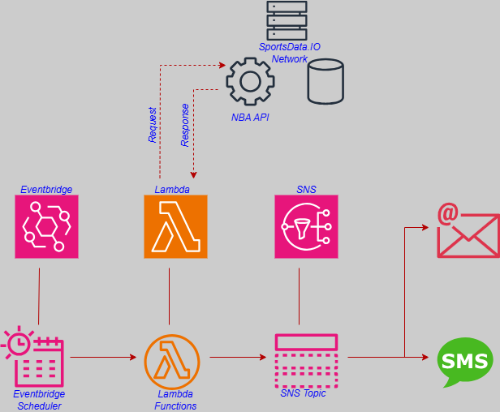
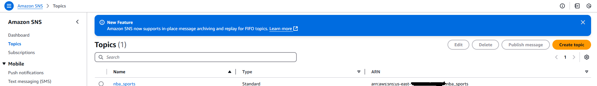
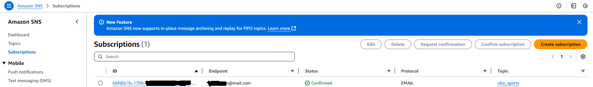
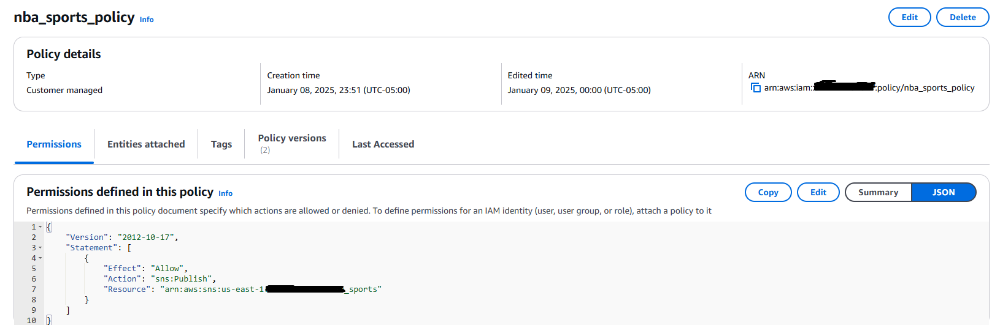
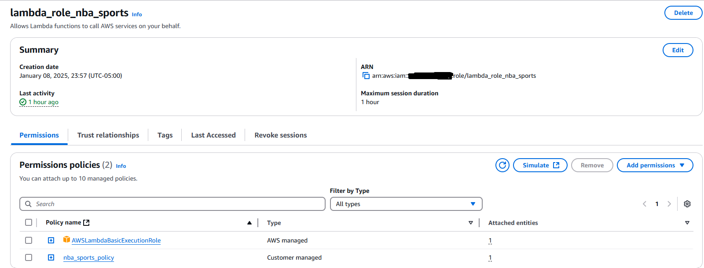
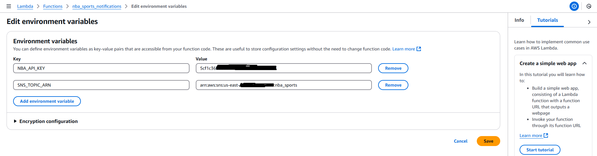
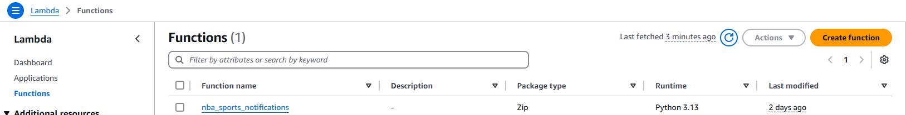
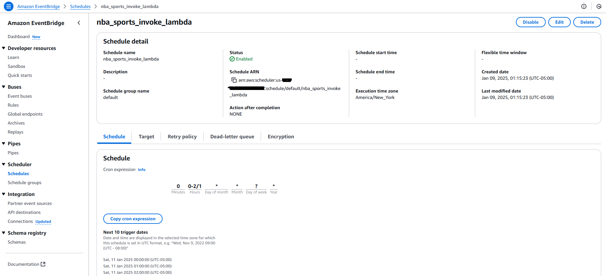
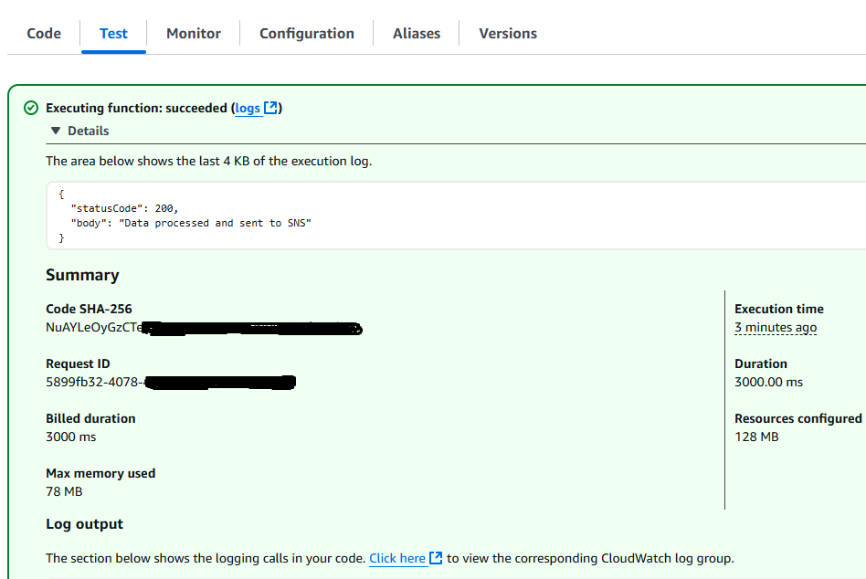
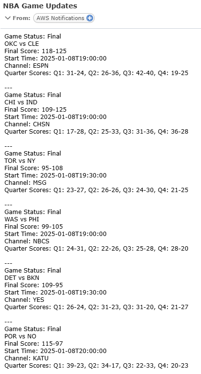

# NBA Games-Final Score Notifications

## Overview
This event-driven build sends real-time NBA game final score alerts to subscribers via email. Leveraging cloud based serverless compute, scheduling and messaging resources you'll be able to provide NBA fans with up-to-date game information. This build demonstrates the effiency of fetching data dynamically and automating workflows while minimizing management of the overall technology stack.

## Features
Real-time NBA final score updates
Detailed Notifications: Teams/Final Score/Start Time/Channel/etc
Convenient delivery direct to subscriber email

## Resources
[Github](https://github.com/aaritch/nba-sports-notifications)
[AWS IAM](https://aws.amazon.com/iam/)
[AWS SNS](https://aws.amazon.com/sns/)
[AWS Lambda](https://aws.amazon.com/lambda/)
[AWS Eventbridge](https://aws.amazon.com/eventbridge/)
[Python 3.13](https://www.python.org/downloads/release/python-3130/)
[SportsDataIO NBA API](https://sportsdata.io/developers/api-documentation/nba)

## Architecture

## Setup
**Create SNS Topic** (click [here](https://signin.aws.amazon.com/signup?request_type=register) to sign up if you dont have an AWS account)
1. Open the AWS Management Console.
2. Navigate to the SNS service.
3. Click Create Topic and select Standard as the topic type.
4. Name the topic (e.g., nba_sports) and note the ARN.
5. Click Create Topic. 

**Create Subscription to SNS Topic**
1. After creating the topic, click on the topic name from the list.
2. Navigate to the Subscriptions tab and click Create subscription.
3. Select a Protocol:
4. Choose Email.
5. Enter a valid email address.
6. Click Create Subscription.
7. Check the inbox of the provided email address.
8. Confirm the subscription by clicking the confirmation link in the email.

**Create SNS Policy**
1. Navigate to IAM in AWS Management Console.
2. Policies → Create Policy.
3. Click JSON and paste the JSON policy from nba_sports_policy.json file
4. Replace REGION and ACCOUNT_ID with your AWS region and account ID.
5. Click Next: Tags (you can skip adding tags).
6. Click Next: Review.
7. Enter a name for the policy (e.g., nba_sports_policy).
8. Review and click Create Policy.

**Create IAM Role for Lambda**
1. Navigate to IAM in AWS Management Console.
2. Roles → Create Role.
3. Select AWS Service and choose Lambda.
4. Attach the following policies:
   SNS Publish Policy (nba_sports_policy) (created in the previous step).
   Lambda Basic Execution Role (AWSLambdaBasicExecutionRole) (an AWS managed policy).
5. Click Next: Tags (you can skip adding tags).
6. Click Next: Review.
7. Enter a name for the role (e.g., lambda_role_nba_sports).
8. Review and click Create Role.
9. Copy and save the ARN of the role for use in the Lambda function.

**Deploy Lambda Function**
1. Navigate to Lambda in AWS Management Console.
2. Click Create Function.
3. Select Author from Scratch.
4. Enter a function name (e.g., nba_sports_notifications).
5. Choose Python 3.x as the runtime.
6. Assign the IAM role created earlier (lambda_role_nba_sports) to the function.
7. Under the Function Code section:
   Copy the content of the src/nba_sports_notifications.py file from the repository.
   Paste it into the inline code editor.
8. Under the Environment Variables section, add the following:
   NBA_API_KEY: your NBA API key.
   SNS_TOPIC_ARN: the ARN of the SNS topic created earlier.
9. Click Create Function.

**Create Eventbridge Schedule**
1. Navigate to Eventbridge in AWS Management Console.
2. Rules → Create Rule.
3. Select Event Source: Schedule.
4. Set the cron schedule for when you want updates (e.g., hourly).
5. Under Targets, select the Lambda function (nba_sports_notifications) and save the rule.

## Test
**Test the build**
1. Open Lambda function in the AWS Management Console.
2. Create a test to simulate execution.
3. Run the function and check CloudWatch Logs for errors.
4. Verify that email notifications were sent to the subscribed users.

## Success

## Links
Big shout out to the good folks at the [30 DAY DEVOPS CHALLENGE](https://ugcshae.my.canva.site/30-day-devops-challenge). Y'all invoke the joy in me to build solutions whether simple or complex!

## Learnings
1. Workflow Automation using Eventbridge
2. Serverless Delpoyment using Lambda
3. Integrating APIs' for data retrieval
4. IAM Role and Policy creation
   
## Next
1. Add additonal Sports via API (NFL, NHL, etc)
2. Add SMS subscriptions via AWS SNS
